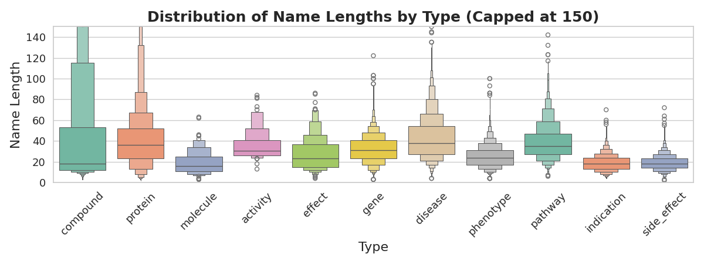
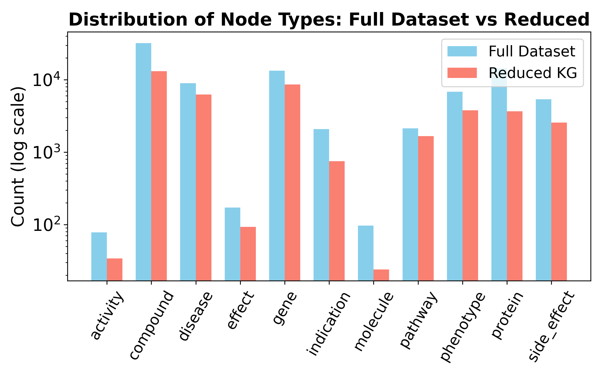
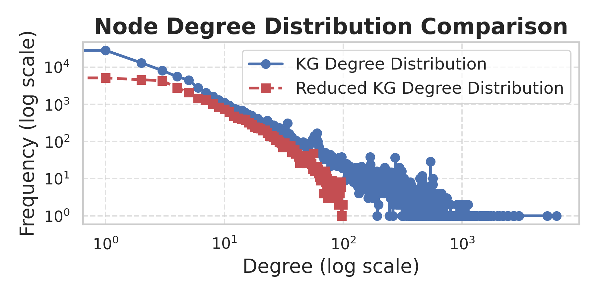
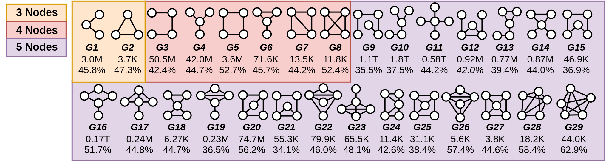

# KG Preprocessing & Graphlet Extraction

This directory contains all the code required to perform the knowledge graph (KG) preprocessing and graphlet extraction for the **BioGraphletQA** dataset.

The pipeline is divided into three main stages, each contained in its own subdirectory:

1.  **`data_hydration/`**: Scripts to populate KG nodes with their textual names from biomedical databases.
2.  **`graph_reduction/`**: A notebook to filter the KG by node degree to optimize for complex question generation.
3.  **`graphlet_extraction/`**: Scripts to sample subgraphs (graphlets) that serve as the basis for QA generation.

---

## 1. Data Hydration

The `data_hydration/` subdirectory contains the script `1_data_cleaning.py` to perform this step.

### Rationale

A key challenge with the OREGANO dataset is that most nodes are represented only by their database identifiers (e.g., `COMPOUND:786`) and lack textual names. To make the data usable for a language model, we first had to "hydrate" the graph by looking up these identifiers.

> **Note**
> To run the hydration script, you must first download the necessary identifier mapping files from Zenodo and place them in the `data_hydration/hydrate_names/` directory.

### Hydration Sources

Each entity was looked up between **December 3rd and 19th, 2023**. We ensured all source knowledge bases had permissive licenses. The preferred order of identifiers used for each entity class is as follows:

* **Compound** (32,083 total): `Already hydrated` (5,165), `PubChem Compound` (24,642), `DrugBank` (910), `NPASS` (1,225), `SIDER` (103), `PharmGKB` (38)
* **Protein** (14,505 total): `UniProtKB` (13,355), `NPASS` (1,150)
* **Molecule** (97 total): `DrugBank` (97)
* **Activity** (78 total): `Already hydrated` (78)
* **Gene** (13,363 total): `NCBI Gene` (13,363)
* **Disease** (8,934 total): `OMIM` (5,738), `SNOMED CT` (717), `MeSH` (385), `UMLS` (796), `Orphanet` (1,238), `PharmGKB` (59)
* **Phenotype** (6,854 total): `Human Phenotype Ontology (HPO)` (6,854)
* **Pathway** (2,128 total): `Reactome` (2,127)
* **Effect** (171 total): `Already Hydrated` (171)
* **Side effect** (5,364 total): `Already hydrated` (5,364)
* **Indication** (2,080 total): `Already hydrated` (2,080)

### Name Length Distribution

As shown below, most entity classes have reasonably sized names, with the exception of some outliers in the `compound` and `protein` classes. For example, some long names resulted from knowledge base formatting issues (e.g., ‘Amyloid-beta precursor protein (APP) (ABPP)...’) or are valid but extremely long chemical names.

---

## 2. Knowledge Graph Reduction

After hydrating the KG, we performed a structural reduction. A single Jupyter notebook in the `graph_reduction/` directory contains all the code needed for this step.

### Rationale

The original KG contains a large number of nodes with a very low degree (edge nodes) and a few nodes with a very high degree (hub nodes). We hypothesized that edge nodes offer limited connectivity for forming complex questions, while hub nodes would lead to redundant graphlets.

To address this, we filtered the graph, **removing all nodes with a degree less than 3 or greater than 100**.

This reduction enhances the variability of nodes in our final dataset while making subsequent processing more computationally tractable. The final graph comprises **41,115 nodes** and **129,992 edges**.

### Post-Reduction Distributions

The figures below confirm that our reduction strategy did not disproportionately affect any single entity class and successfully trimmed the long tails of the degree distribution.

| Node Type Distribution (Before vs. After)                                    | Node Degree Distribution (Before vs. After)                                 |
| :---------------------------------------------------------------------------: | :-------------------------------------------------------------------------: |
|  |  |

---

## 3. Graphlet Extraction

The final preprocessing step is graphlet extraction. The code and associated files are located in the `graphlet_extraction/` directory.

### Requirements

> **Important**
> This step **requires** a Conda environment with the `graph-tool` library installed, as it is not available via Pip.

### Process

The `graphlet_extraction` directory contains a `run.sh` script that executes the main Python script (`extract_graphlets.py`). We used the 29 unique, non-isomorphic graphlet shapes containing 3-5 nodes, shown below. The goal was to sample approximately **10,000 instances** of each graphlet shape to serve as the foundation for our QA dataset.

