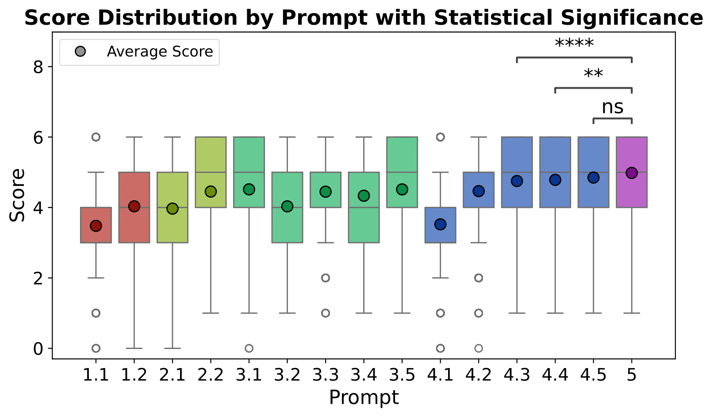

# Prompt Ablation Study

This directory contains all the code and notebooks used to perform the prompt ablation study for the BioGraphletQA project. The goal of this study was to systematically evaluate different prompting strategies and identify the most effective one for generating high-quality, complex biomedical questions.

## Workflow & File Descriptions

The process is broken down into several numbered steps. You can follow this sequence to replicate the study.

1.  **Build Prompt Templates (`1_1_prompt_builder.ipynb`)**

      * This notebook uses the modular components defined in `prompt_builder.json` to construct the 15 distinct prompt templates used in the study. The final templates are saved to `prompt_templates.json`.

2.  **Generate Initial QA Pairs (`1_2_initial_generation.py` & `1_2_run_prompts.sh`)**

      * The Python script runs the generation process, testing each of the 15 prompts on a subset of 1,000 graphlets.
      * The `1_2_run_prompts.sh` script is an example of how to execute this generation on a Slurm-based cluster.

3.  **Evaluate Generated Outputs (`feature_engineering.ipynb`, `2_2_prompt_eval_generator.py`, `2_2_run_prompt_eval.sh`)**

      * The first part of the `feature_engineering.ipynb` notebook prepares the evaluation prompts based on our defined criteria.
      * `2_2_prompt_eval_generator.py` uses these prompts to have an LLM-as-a-judge score the outputs from step 2. The `2_2_run_prompt_eval.sh` script is used to run this evaluation.

4.  **Analyze Results (`feature_engineering.ipynb`)**

      * The final section of the `feature_engineering.ipynb` notebook contains the code used to parse the evaluation results, calculate scores, and generate the analysis and figures presented below.

-----

## Methodology

Minor prompt modifications can significantly affect LLM performance. Since our dataset is fully synthetic, we lacked ground truth examples for traditional evaluation. Instead, we were inspired by the "LLM-as-a-judge" paradigm and used **Llama-3.1-Nemotron-70B** to score the generated QA pairs based on a set of six criteria. Each criterion contributed one point, for a maximum possible score of 6.

### Evaluation Criteria

1.  **Answer node present in question:** Ensures the question does not contain the answer in an obvious way. Example: *"Is X a side effect of drug Y?"* (This would be a simple yes/no question).
2.  **Question contains graphlet-based terminology or hints:** Prevents the generated questions from explicitly referencing the graph structure. A common issue was that questions mentioned "connections" between entities, which is not typical of language used by biomedical experts. Example: *"What is the connection between X and Y?"*
3.  **Answer contains graphlet-based terminology:** Similar to the previous feature, but focused on ensuring that answers do not explicitly describe connections between entities.
4.  **Scientifically accurate question:** Ensures that the generated question is meaningful and logically sound from a biomedical perspective.
5.  **Scientifically accurate answer:** Ensures that the provided answer is scientifically valid and free from inaccuracies.
6.  **Question is properly answered:** Verifies that the answer correctly addresses the question without ambiguity or irrelevance.

### Prompt Design

We designed 15 distinct prompt variations using a modular approach. These were evaluated on 1,000 randomly selected graphlets. Our designs were inspired by Chain-of-Thought (CoT) prompting, providing the model with structured reasoning steps. We also tested a reflection module where the model critiqued its own output.

The 15 prompt configurations are grouped into five categories:

1.  **Baseline Prompts**: Targeted at setting baselines.
      * 1.1 `[Baseline]`: The simplest version of the prompt with no additional instructions or examples.
      * 1.2 `[1.1 + Simple Example]`: The baseline prompt with a simple example to guide the model.
2.  **QA Instruction Prompts**: Gives the model strict instructions on how to generate QA pairs.
      * 2.1 `[1.1 + Question Instruction + Answer Instruction]`: The baseline prompt with additional structured instructions on generating questions and answers.
      * 2.2 `[2.1 + Simple Example]`
3.  **Graphlet Analysis Prompts**: Forces the model to analyze the graphlet.
      * 3.1 `[1.1 + Analyze Graphlet Instruction + Final Analysis]`
      * 3.2 `[3.1 + Node Types]`: Asks the model to find *Question*, *Answer* and *Hidden Nodes*.
      * 3.3 `[3.2 + Simple Example]`
      * 3.4 `[3.2 + QA Instructions]`
      * 3.5 `[3.4 + Simple Example]`
4.  **Reflection Prompts**: Gets the model to reflect on its generated QA pair and improve it.
      * 4.1 `[1.1 + Reflection Instruction]`
      * 4.2 `[4.1 + Complex Example]`: Adds a complex example that includes graphlet analysis, reflection and re-writing of the QA.
      * 4.3 `[4.1 + Question and Answer Evaluation]`: Adds explicit evaluation criteria.
      * 4.4 `[4.3 + Complex Example]`
      * 4.5 `[4.4 + QA Instruction]`
5.  **Full Prompt (All Modules)**: A comprehensive prompt that integrates all components into a single structured format.

-----

## Results

The performance of different prompt configurations varied significantly. Before scoring, any output that was not valid JSON was automatically given a score of zero to penalize prompts that failed to produce structured output.

The baseline prompt (1.1) achieved a score of **3.45/6**. Adding a simple example (1.2) provided a slight boost to **3.94/6**. More complex strategies yielded better results. For instance, reflection-based prompts combined with examples and evaluation criteria (4.5) reached a score of **4.79/6**.

Ultimately, the **Full Prompt (5.0)**, which integrated all modules, achieved the highest score of **4.91/6**. This result confirms that a comprehensive, structured prompt with guided reasoning, examples, and self-reflection yields the best performance for this complex generation task. While a Mann–Whitney–Wilcoxon test indicated that the performance difference between the top two prompts (5.0 and 4.5) was not statistically significant, we selected the more robust full prompt for the final dataset generation.

