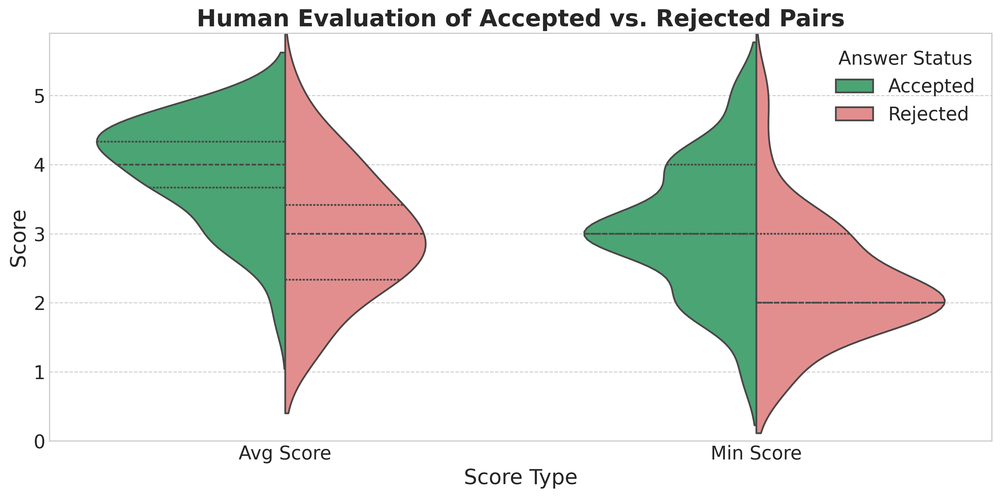
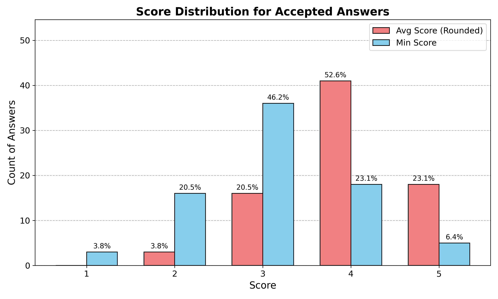
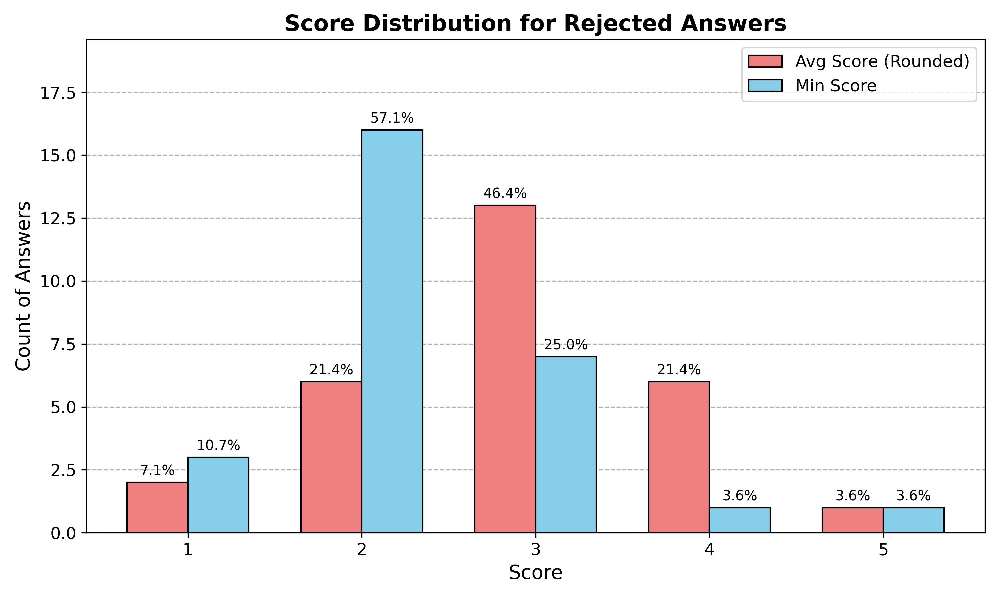
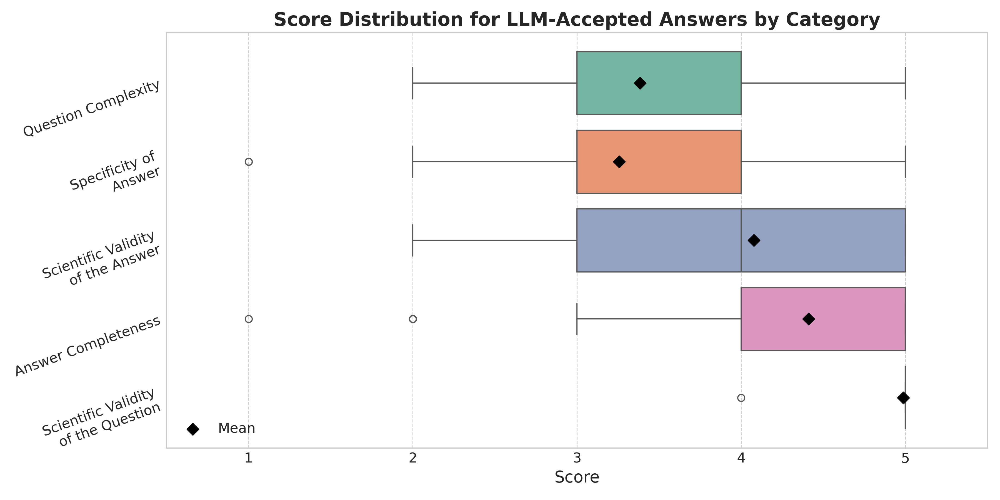

# 4. Dataset Filtering & Human Evaluation

This directory contains the scripts and notebooks for the final two stages of the BioGraphletQA dataset creation: **LLM-based filtering** and **human evaluation**. The goal of this phase is to programmatically filter the generated dataset to improve its quality and then use expert human validation to confirm the effectiveness of the filtering process and the quality of the final data.

## Workflow

1.  **LLM-Based Filtering**: The raw, generated dataset is passed through another LLM instance, which acts as a judge to evaluate the coherence and correctness of each QA pair.
2.  **Human Evaluation Set Generation**: A small, stratified sample of both accepted and rejected QA pairs is prepared for manual review.
3.  **Analysis of Human Evaluation**: The results from the human annotator are analyzed to validate the automated filter and assess the final dataset's quality.

---

## LLM-Based Filtering

This is the primary automated quality control step. An LLM is prompted to analyze each QA pair's logical consistency and scientific validity, independent of the original graphlet. A large portion of the initial dataset is eliminated, leaving a smaller but higher-quality set of QA pairs.

* **`1_DS_FILTERING.py`**: The core Python script that runs the LLM-based filtering process.
* **`1_filtering.sh`**: An example Slurm batch script for executing the filtering on an HPC cluster.
* **`2_data_processing_v2.ipynb`**: Retrieves core dataset statistics after filtering. 
* **`3_post_filter_analy.ipynb`**: Some more in depth analysis. 

### Filtering Statistics

The following table provides detailed statistics for each of the 29 graphlet shapes after the generation and filtering process. It shows the initial sampling count and the final number of QA pairs that were accepted by the LLM filter, along with the acceptance rate.

| Graphlet ID | Total Occurrences | Downsampling Ratio | Sampled Count | Generated | Accepted | Acceptance Rate (%) |
| :---: | :---: | :---: | :---: | :---: | :---: | :---: |
| 1 | 2,980,635 | 3.35e-3 | 9,954 | 9,913 | 4,544 | 45.8 |
| 2 | 3,702 | 1.00e+0 | 3,702 | 3,690 | 1,744 | 47.3 |
| 3 | 50,513,861 | 1.98e-4 | 9,826 | 9,783 | 4,149 | 42.4 |
| 4 | 41,964,954 | 2.38e-4 | 10,108 | 10,021 | 4,475 | 44.7 |
| 5 | 3,609,661 | 2.77e-3 | 10,165 | 10,103 | 5,325 | 52.7 |
| 6 | 71,664 | 1.40e-1 | 9,913 | 9,810 | 4,485 | 45.7 |
| 7 | 13,537 | 7.39e-1 | 9,939 | 9,870 | 4,365 | 44.2 |
| 8 | 11,794 | 8.48e-1 | 10,038 | 9,948 | 5,212 | 52.4 |
| 9 | 1,080,297,928 | 9.26e-6 | 9,988 | 9,817 | 3,485 | 35.5 |
| 10 | 1,810,874,588 | 5.52e-6 | 9,952 | 9,806 | 3,679 | 37.5 |
| 11 | 584,613,716 | 1.71e-5 | 10,126 | 9,939 | 4,390 | 44.2 |
| 12 | 922,997 | 1.08e-2 | 10,078 | 9,874 | 4,144 | 42.0 |
| 13 | 772,905 | 1.29e-2 | 10,100 | 9,885 | 3,897 | 39.4 |
| 14 | 871,384 | 1.15e-2 | 9,946 | 9,723 | 4,275 | 44.0 |
| 15 | 46,904 | 2.13e-1 | 10,001 | 9,823 | 3,628 | 36.9 |
| 16 | 166,337,860 | 6.01e-5 | 9,946 | 9,841 | 5,087 | 51.7 |
| 17 | 239,193 | 4.18e-2 | 10,143 | 9,949 | 4,459 | 44.8 |
| 18 | 6,267 | 1.00e+0 | 6,267 | 6,103 | 2,725 | 44.7 |
| 19 | 225,464 | 4.44e-2 | 10,088 | 9,878 | 3,606 | 36.5 |
| 20 | 74,698,349 | 1.34e-4 | 9,894 | 9,781 | 5,496 | 56.2 |
| 21 | 55,278 | 1.81e-1 | 9,878 | 9,629 | 3,281 | 34.1 |
| 22 | 79,900 | 1.25e-1 | 10,013 | 9,846 | 4,533 | 46.0 |
| 23 | 65,548 | 1.53e-1 | 10,031 | 9,621 | 4,629 | 48.1 |
| 24 | 11,395 | 8.78e-1 | 9,976 | 9,741 | 4,149 | 42.6 |
| 25 | 31,145 | 3.21e-1 | 9,989 | 9,781 | 3,759 | 38.4 |
| 26 | 5,617 | 1.00e+0 | 5,617 | 5,292 | 3,036 | 57.4 |
| 27 | 3,810 | 1.00e+0 | 3,810 | 3,690 | 1,647 | 44.6 |
| 28 | 18,217 | 5.49e-1 | 10,067 | 9,577 | 5,593 | 58.4 |
| 29 | 44,022 | 2.27e-1 | 10,019 | 9,639 | 6,059 | 62.9 |

---

## Human Evaluation

After automated filtering, we performed a human evaluation with a domain expert to validate the process.

* **`4_Human_eval_set.ipynb`**: This notebook generates the set of QA pairs for human annotation.
* **`5_human_eval_results_v2.ipynb`**: This notebook contains the code to analyze the annotation results provided by the expert. The results are also available in the `.csv` files in this directory.

### Results of Human Evaluation

Our human annotation process validates the effectiveness of the automated filtering pipeline. A total of 106 QA pairs (78 accepted and 28 rejected by the filter) were evaluated by a domain expert. The violin plot below gives a high-level summary, showing a clear shift in the minimum and average scores between the pairs our filter accepted versus those it rejected. This disparity provides strong evidence that the LLM filter is effective at identifying and removing low-quality data.

To further illustrate the quality difference, the plots below offer a direct comparison of the answer scores for the accepted versus rejected sets. The scores for accepted answers are consistently high across all criteria (validity, specificity, completeness). In contrast, the rejected answers show significantly lower scores, particularly failing on scientific validity and completeness. This visual evidence confirms our filter's ability to discard problematic QA pairs.

| Answer Scores for **Accepted** QA Pairs                                                              | Answer Scores for **Rejected** QA Pairs                                                              |
| :--------------------------------------------------------------------------------------------------: | :------------------------------------------------------------------------------------------------: |
|  |  |

Finally, the distribution of scores for the **entirety (question + answer)** of the accepted QA pairs confirms the high quality of the final dataset. All questions were rated as scientifically valid, and 88.46% were deemed complex (score ≥ 3). A holistic view shows that **75.64% of QA pairs achieved a minimum score of 3 across all answer criteria**, confirming their overall acceptability.

> #### Acknowledgment of Limitations
> We acknowledge the limitation of relying on a single human annotator for our validation process. Nevertheless, this approach provides a crucial layer of verification for our automated filtering pipeline, offering an initial confirmation of its efficacy. Given the well-documented challenges in achieving consistent agreement between LLMs and human evaluators, our use of a single, well-qualified annotator is a pragmatic and informative method for validating our results.