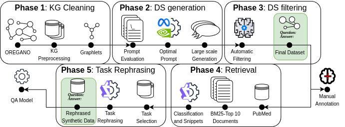

# BioGraphletQA: Knowledge-Anchored Generation of Complex QA Datasets

This repository contains the official code and resources for the paper **"BioGraphletQA: Knowledge-Anchored Generation of Complex QA Datasets"**.

-----

## Overview

**BioGraphletQA** is a principled and scalable framework for systematically generating complex, factually-grounded Question Answering (QA) data. The core of our framework is a novel **graphlet-anchored generation process**, where small subgraphs from a Knowledge Graph are used as a factual base to control the complexity and ensure the grounding of questions generated by Large Language Models (LLMs).

This repository provides:

  * The full data generation pipeline, from KG processing to downstream task rephrasing.
  * The complete **BioGraphletQA dataset**, containing **119,856** complex biomedical QA pairs.
  * Scripts to reproduce the experiments and analysis presented in the paper.



-----

## The BioGraphletQA Pipeline

The dataset generation process consists of six main stages, with each numbered directory corresponding to a stage in the pipeline.

1.  **KG Acquisition & Preprocessing**: We download the OREGANO KG, then hydrate nodes with their textual names and apply a degree-based reduction to filter for nodes best suited for complex question generation. Finally, we extract graphlets (subgraphs of 3-5 nodes) to serve as the factual basis for generation.
2.  **Prompt Ablation Study**: We conduct a rigorous, systematic study to identify the optimal prompt for guiding an LLM to generate high-quality, scientifically valid questions from the graphlets.
3.  **Large-Scale Dataset Generation**: Using the best prompt, we generate the full raw dataset of QA pairs from all sampled graphlets.
4.  **LLM-Based Filtering & Human Validation**: A second LLM pass acts as a judge, filtering out lower-quality or incoherent QA pairs. This automated process is validated by a human domain expert to ensure its effectiveness.
5.  **Supporting Document Retrieval**: We enrich the dataset by retrieving relevant abstracts from PubMed for each QA pair using BM25 and then use an LLM to identify and extract the most salient supporting snippets.
6.  **Task-Specific Rephrasing**: To demonstrate utility, we rephrase a subset of the dataset into the formats of established benchmarks like MedQA (multiple-choice) and PubMedQA (yes/no) for downstream evaluation.

-----

## Repository Structure

The code is organized sequentially by numbered directories. Generally, scripts within each directory are also numbered in the order they should be run. Directories starting with an underscore (`_`) contain data outputs, which will be available on Zenodo.

```text
├── 0-kg_aquisition/          # Script for downloading the OREGANO KG
├── 1-kg_preprocessing/       # KG hydration, reduction, and graphlet extraction
├── 2-prompt_ablation/        # Scripts and notebooks for the prompt ablation study
├── 3-ds_generation/          # Large-scale QA pair generation from graphlets
├── 4-ds_filtering/           # LLM-based quality filtering and human evaluation analysis
├── 5-retrieval/              # LLM-based annotation of retrieved PubMed documents
├── 6-rephrasing/             # Scripts for downstream task rephrasing and evaluation
│
├── _figures/                 # Figures used in the paper and READMEs
└── requirements.txt          # Python package requirements
```

-----

## Requirements

This project requires two separate environments due to library dependencies.

1.  **Graph Processing**: The scripts in `1-kg_preprocessing` require **graph-tool**. It must be installed via Conda:

    ```bash
    conda create -n graphtool -c conda-forge graph-tool
    conda activate graphtool
    ```

2.  **Main Environment**: All other scripts use standard Python packages. Create a virtual environment and install them using:

    ```bash
    python -m venv venv
    source venv/bin/activate
    pip install -r requirements.txt
    ```

-----

## Dataset Statistics

The final BioGraphletQA dataset contains **119,856** question-answer pairs, each grounded in a graphlet of 3 to 5 nodes. The table below shows the generation and acceptance statistics for each of the 29 graphlet shapes.

| Graphlet ID | Sampled Graphlets | Generated QA Pairs | Accepted QA Pairs | Acceptance Rate |
| :---: | :---: | :---: | :---: | :---: |
| 1 | 9,954 | 9,913 | 4,544 | 45.8% |
| 2 | 3,702 | 3,690 | 1,744 | 47.3% |
| 3 | 9,826 | 9,783 | 4,149 | 42.4% |
| ... | ... | ... | ... | ... |
| 28 | 10,067 | 9,577 | 5,593 | 58.4% |
| 29 | 10,019 | 9,639 | 6,059 | 62.9% |

*(Table abridged for brevity. See `4-ds_filtering/README.md` for the full table.)*

-----

## Quality Assessment

The quality of the dataset and the effectiveness of our LLM-based filter were validated by a **human domain expert**.

  * A total of **106 QA pairs** (78 accepted by the filter, 28 rejected) were manually annotated.
  * The evaluation used a 5-point Likert scale across several criteria, including **Scientific Validity**, **Question Complexity**, and **Answer Completeness**.
  * The results confirmed a significant quality difference between the accepted and rejected sets, validating our automated filtering approach.


## How to Cite

If you use the BioGraphletQA framework or dataset in your research, please cite our paper:

```bibtex

```